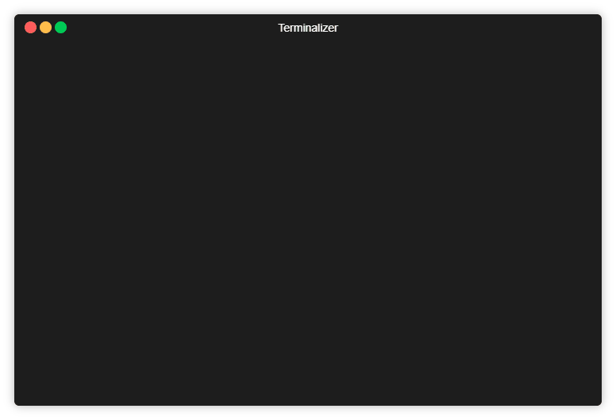

# .gitignoreManager

This is bash script which you can use to manage .gitignore files in your projects.
Allows you to:  
* Search appropriate .gitignore file in https://github.com/github/gitignore which is cloned into installation folder
* Copy selected .gitignore file to current working directory

## Installation

Windows:

Place git-ignore.sh into your '%USERPROFILE%\Documents\gitScripts' folder
Open bash and type

```cmd
git ignore --install 
```
This will clone https://github.com/github/gitignore repo and make myGitIgnore folder when you can place your .gitiignore file.

## Usage



For example you can type:

```cmd
git ignore python
```
This will return 
```
JupyterNotebooks.gitignore
Nikola.gitignore
Python.gitignore
```
If you want to copy one of the listed .gitignore file into your current working directory, type more explicit name for example:
```shell
> git ignore python.gitignore
Do you wanna copy /c/Users/Urban/Documents/gitScripts/gitIgnore/gitignore/Python.gitignore to your directory? [y/n]
> y
Copied /c/Users/Urban/Documents/gitScripts/gitIgnore/gitignore/Python.gitignore into /c/testGitIgnore

```

## Contributing
Pull requests are welcome. For major changes, please open an issue first to discuss what you would like to change.


## License
[MIT](https://choosealicense.com/licenses/mit/)